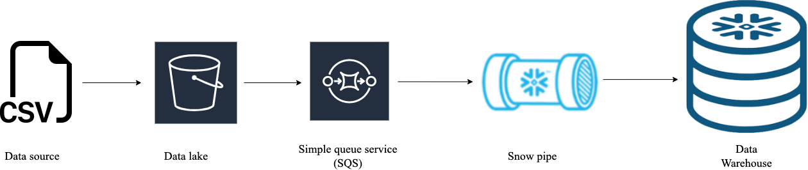
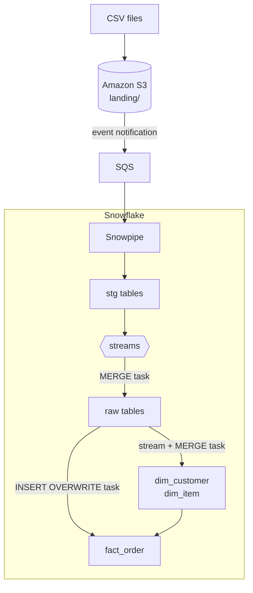

# Event-Driven ETL from AWS S3 into Snowflake

An automated pipeline that loads retail CSV files from AWS S3 into Snowflake and builds a star schema (two dimensions and one fact table). New files are picked up automatically by Snowpipe, and a chain of Snowflake tasks moves the data through staging, raw and transformed layers without any external orchestration tool.



## Tech stack

AWS S3 · AWS SQS · Snowflake (Snowpipe, streams, tasks, storage integration) · SQL

## How it works



1. A CSV file lands in `s3://<bucket>/landing/<entity>/`.
2. S3 sends an event notification to an SQS queue managed by Snowflake.
3. **Snowpipe** (`auto_ingest = true`) copies the file into a staging table in the `stg` schema.
4. A **stream** on the staging table records the new rows.
5. A **task tree** (one per entity) runs every minute, but only when the stream has data:

| Order | Task | What it does |
|---|---|---|
| 1 (root) | `pause_pipe_<entity>` | Pauses the pipe so no new files load mid-run |
| 2 | `<entity>_raw_tsk` | Merges the stream into the `raw` table (insert new, update existing) |
| 3 | `dim_<entity>_tsk` / `fact_order_tsk` | Loads the `transformed` dimension or fact table |
| 4 | `truncate_staging_table_<entity>` | Clears the staging table for the next batch |
| 5 | `play_pipe_<entity>` | Resumes the pipe |

## Data model

| Table | Type | Key | Notes |
|---|---|---|---|
| `transformed.dim_customer` | Dimension | `customer_dim_key` (surrogate) | Type 1 slowly changing dimension: changed values overwrite old ones; `added_timestamp` and `updated_timestamp` track changes |
| `transformed.dim_item` | Dimension | `item_dim_key` (surrogate) | Type 1 SCD, with price, class, category and validity dates |
| `transformed.fact_order` | Fact | `order_fact_key` (surrogate) | Grain: one row per **order date × customer × item**, with order count, quantity, sale price, discount, coupon, net paid, tax and profit |

The fact table joins raw orders to both dimensions to swap natural IDs for surrogate keys.

## Design decisions

- **Pausing the pipe during each run.** The staging table is truncated at the end of every run. If Snowpipe kept loading during the run, rows arriving after the merge would be deleted by the truncate before being processed. Pausing first and resuming last closes that gap.
- **Deduplicating before merging (item pipeline).** If the same item appears more than once in a batch, `row_number()` partitioned by `item_id` keeps only the latest version by `start_date`, so the `MERGE` never sees conflicting rows.
- **Streams as triggers.** Every task tree checks `system$stream_has_data()`, so warehouse compute is only used when new data has actually arrived.
- **Layered schemas.** `stg` holds exactly what landed, `raw` holds the cleaned, upserted history, and `transformed` holds the business-ready star schema.
- **Storage integration instead of access keys.** Snowflake reads S3 through an IAM role, so no AWS credentials appear anywhere in the code.

## Repository structure

```
├── etl_script/
│   ├── customer-end-to-end-pipeline-script.sql   # dim_customer pipeline
│   ├── item-end-to-end-pipeline-script.sql       # dim_item pipeline
│   └── order-end-to-end-pipeline-script.sql      # fact_order pipeline
├── source_data/                                  # sample CSV files
├── setup.sql                                     # warehouse, schemas, file format, integration, stage
├── architecture-diagram.png
└── naming-conventions.pdf
```

## How to run

1. **Set up AWS:** create an S3 bucket and an IAM role Snowflake can assume (see the [Snowflake guide](https://docs.snowflake.com/en/user-guide/data-load-s3-config-storage-integration)).
2. **Run `setup.sql`** after replacing the placeholders. Add the values from `desc integration s3_int` to the IAM role's trust policy.
3. **Run the pipeline scripts** in this order: customer, item, order. The order pipeline depends on both dimensions.
4. **Connect S3 to Snowpipe:** run `show pipes`, copy the `notification_channel` (SQS ARN), and create an S3 event notification on the `landing/` prefix pointing to it.
5. **Start the task trees.** Each script includes a resume block. Child tasks are resumed first and the root task last, as Snowflake requires.
6. **Upload the sample files** from `source_data/` to `landing/customer/`, `landing/item/` and `landing/order/`.

## Monitoring

Each script ends with checking queries, including:

```sql
-- task runs, newest first
select * from table(information_schema.task_history()) order by scheduled_time desc;

-- pipe status
select system$pipe_status('stg.stg_customer_pipe');
```

## Limitations and next steps

- **Full fact rebuild.** `fact_order` is rebuilt with `insert overwrite` on every run. That's fine at this scale; a larger dataset would need an incremental load.
- **Order matching key.** The raw order merge matches on date, time, item ID and description. Adding customer ID or a true order ID would prevent two customers' orders colliding.
- **Late-arriving dimensions.** The fact load uses inner joins, so an order whose customer or item hasn't loaded yet is left out until it does. A default "unknown" dimension row would keep those orders visible.
- **No history on dimensions.** Both dimensions are Type 1. Moving `dim_item` to Type 2 would preserve price history.
- **No automated tests.** Next step: row-count and null checks after each load, or moving the transformation layer into dbt with tests.
